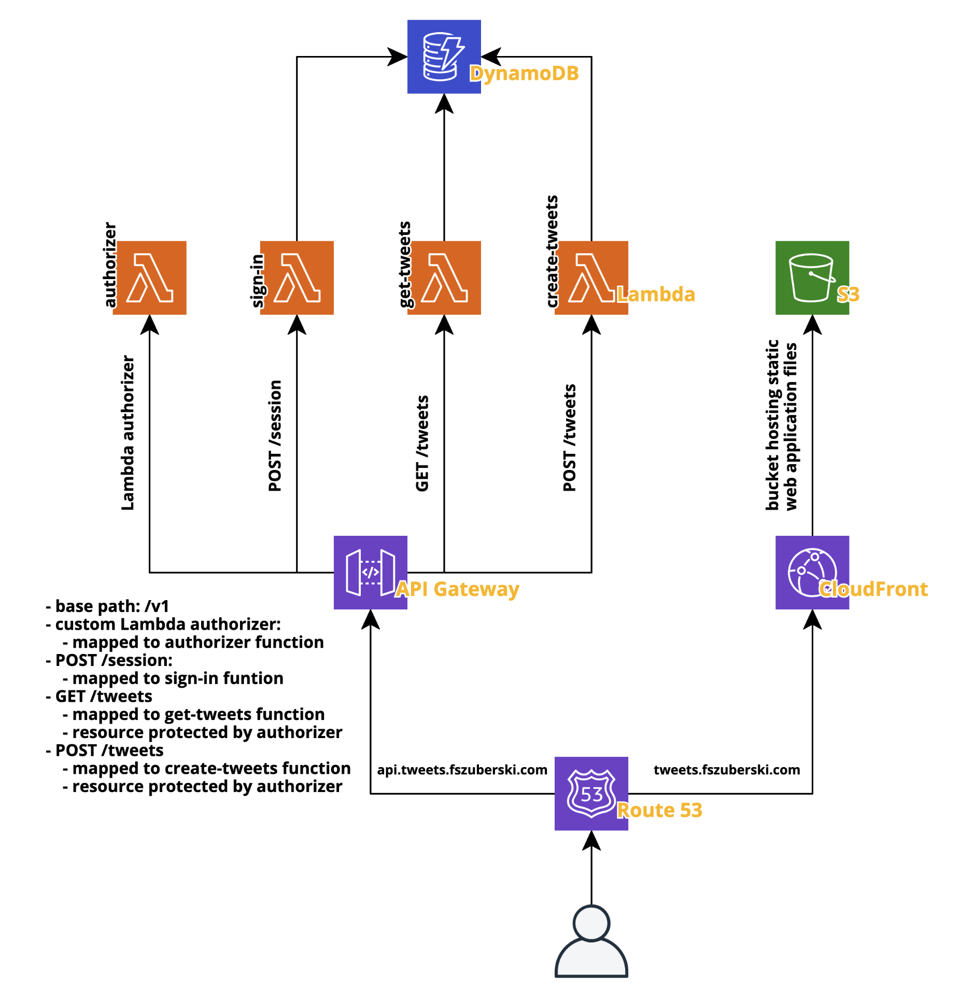

# Tweets

---

## Basic deployment diagram




## tweets-backend

---

#### Tech stack:
* Java w/o any framework
* libraries:
  * [AWS Lambda / Events / DynamoDB / IAM libraries](https://github.com/aws/aws-sdk-java)
  * [JJWT](https://github.com/jwtk/jjwt)
  * [Bcrypt](https://github.com/patrickfav/bcrypt)
  * [Lombok](https://projectlombok.org/)
  * (test) [JUnit5](https://junit.org/junit5/)
  * (test) [Mockito](https://site.mockito.org/)
* build tool:
  * [Gradle](https://gradle.org/)

#### Directory structure

```
|-- buildSrc 
    - gradle configuration files for the multi-module project
    
    |-- src/main/groovy/tweets.backend.java-*-conventions.gradle
        - base gradle configuration files for all projects/subprojects
        - 3 types of files:
            - application - 
            - library - library / shared project configuration
            - common - base configuration for both application and library type projects
            
|-- functions
    - each subproject is a Lambda Function
    
    |-- authorizer
        - Lambda-based API Gateway authorizer
        - handles JWT validation for requests to protected resources
    
    |-- sign-in
        - generates JWTs for users
        
    |-- get-tweets
        - handles querying for Tweets
        
    |-- create-tweets
        - handles creating Tweets
 
|-- shared
    - common library-type projects that are imported and used in Lambda Functions   
    
    |-- jwt
        - utilities for generating and validating JWTs
        
    |-- rest
        - utilities for handling 
         
    |-- persistence
        - database (DynamoDB) connectivity; handles querying and insertion of data
        
|-- ...  
```

#### Database table design

Based on this excellent talk by Alex
Debrie: [AWS re:Invent 2019: Data modeling with Amazon DynamoDB (CMY304)](https://www.youtube.com/watch?v=DIQVJqiSUkE&list=LL&index=2&t=2147s)

Identified entities:

* User:
  
|             | PK (Primary Key) | SK (Primary Key)             | CreatedAt          | PasswordHash       | ProfilePictureURL                                                            | Username   |
|-------------|------------------|------------------------------|--------------------|--------------------|------------------------------------------------------------------------------|------------|
| Explanation | Partition Key    | Sort Key (PROFILE#<Username>)| ISO8601 string     | encrypted password | User profile picture                                                         |            |
| Example     | USER#fszuberski  | PROFILE#fszuberski           | PROFILE#fszuberski | (bcrypt)           | https://i.pinimg.com/originals/18/ed/33/18ed330d561a580f77dc39c941455f0e.jpg | fszuberski |


* Tweet:
  
|             | PK (Primary Key) | SK (Primary Key)                                                | CreatedAt                  | CreatedBy       | ProfilePictureURL                                                            | Text                                                                                                                                                | TweetId                              |
|-------------|------------------|-----------------------------------------------------------------|----------------------------|-----------------|------------------------------------------------------------------------------|-----------------------------------------------------------------------------------------------------------------------------------------------------|--------------------------------------|
| Explanation | Partition Key    | Sort Key (TWEET#<CreatedAt>#<TweetId>)                          | ISO8601 string             | User identifier | User profile picture                                                         |                                                                                                                                                     | Unique Tweet UUID                    |
| Example     | USER#fszuberski  | TWEET#2021-05-22T14:43:18Z#2d07d914-e3d8-4f74-a5dc-c7fcc053a710 | 2021-05-31T19:08:28.422847 | USER#fszuberski | https://i.pinimg.com/originals/18/ed/33/18ed330d561a580f77dc39c941455f0e.jpg | Calling it "serverless" without acknowledging the servers is like calling it "passive income" without acknowledging the effort to make it "passive" | 2d07d914-e3d8-4f74-a5dc-c7fcc053a710 |


Identified queries:

* fetch tweets created by user
* fetch tweets created by other users
* (additional) fetch all users
    * currently is a full table scan
    * can be easily turned into a query by extending the challenge
        * extention: handling of user followers and creating tweets only for the followers
        * solution: keeping a list


* Additional notes on current design:
    * a copy of each Tweet is created for every User (including the User creating the Tweet)
    * optimised for reads

## tweets-frontend

---

Tech stack:
* [ReactJS](https://reactjs.org/)
* [Redux](https://redux.js.org/)